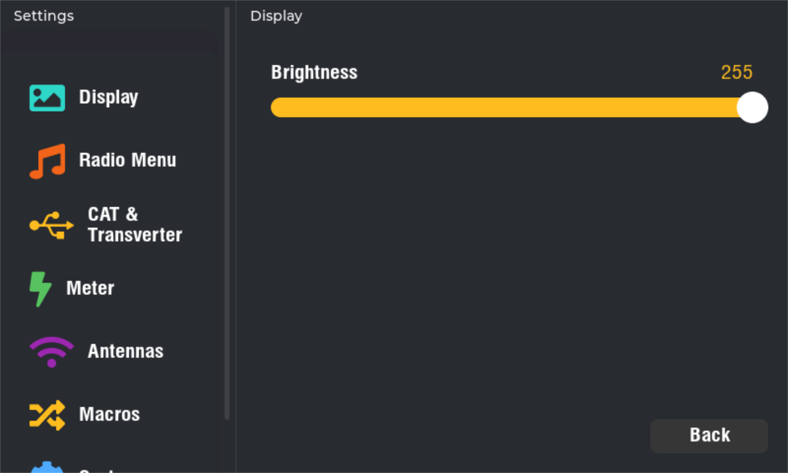
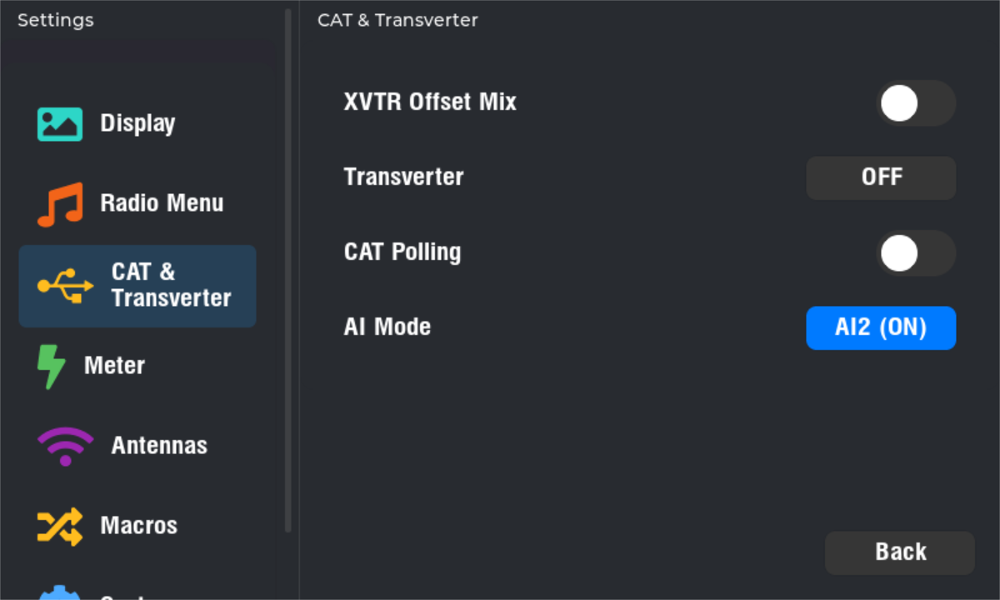
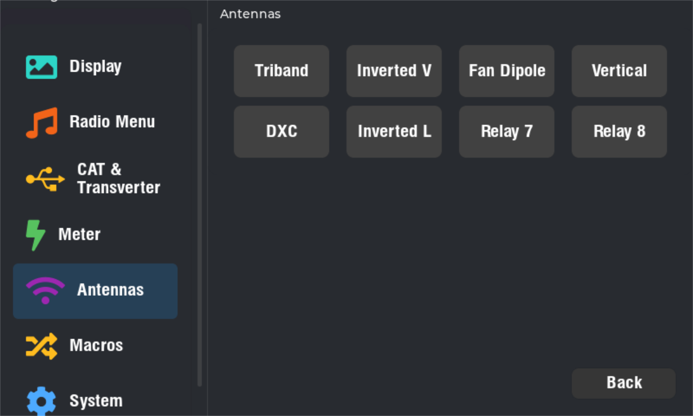

# Remote Radio Display

Standalone touchscreen display firmware for Kenwood TS-590SG operation. Connects directly to the radio via UART, parses CAT commands to track radio state, and renders a real-time operating UI with touch controls.

## Supported Hardware

| Board | SoC | Display | Resolution |
|-------|-----|---------|------------|
| Sunton ESP32-8048S050C | ESP32-S3 | 5" RGB parallel IPS | 800x480 |
| Guition JC-ESP32P4-M3 | ESP32-P4 | 5" MIPI-DSI IPS | 1280x720 |

Both boards use 16+ MB flash and PSRAM. The ESP32-P4 board includes an ESP32-C6 coprocessor for WiFi/BLE via `esp_wifi_remote`.

## Features

- **CAT Protocol**: Stateful TS-590SG CAT parser (`main/cat_parser.cpp`) with UART transport.
- **Touchscreen UI**: LVGL-based interface with resolution-independent scaling across both targets.
- **Remote Operation**: WiFi connectivity for antenna control and time synchronization.
- **Antenna Control**: WebSocket-based antenna switch integration with local state caching.
- **GPS/NTP**: Time synchronization via NTP or GPS serial input.
- **System Health**: Heap/stack monitoring, task watchdogs, and CAT activity tracking.

## Screenshots

| Main operating screen | Settings & display |
|---|---|
|  |  |
| S/ALC/SWR meters, frequency, mode, VFO and function keys | Categorized settings with display brightness control |

| CAT & Transverter config | Antenna switching |
|---|---|
|  |  |
| Transverter offset, CAT polling, and AI mode toggles | One-touch antenna relay switching via WebSocket |

## Prerequisites

- [ESP-IDF](https://docs.espressif.com/projects/esp-idf/en/stable/esp32s3/get-started/) v5.5 or newer
- Kenwood TS-590SG (or compatible CAT rig) on the CAT UART
- Optional: network access to the antenna controller service

## Quick Start

```bash
# ESP32-S3
idf.py set-target esp32s3
idf.py build
idf.py flash monitor

# ESP32-P4
idf.py set-target esp32p4
idf.py build
idf.py flash monitor
```

Target-specific configuration is handled automatically via `sdkconfig.defaults.esp32s3` and `sdkconfig.defaults.esp32p4`.

## Project Structure

```
main/
  cat_parser.cpp/h      # CAT command parser
  cat_polling.cpp/h      # CAT polling engine
  cat_state.cpp/hpp      # Radio state management
  uart.cpp/h             # UART transport
  main.cpp               # Application entry point
  gfx/                   # LCD drivers, LVGL init, touch
  ui/                    # Screens, components, fonts
  radio/                 # Radio state machine
```

## Tests

Unity-based parser tests live in `test/`. Run with:

```bash
idf.py -T test build
```

## License

Released under the [GNU AGPL v3](LICENSE).
